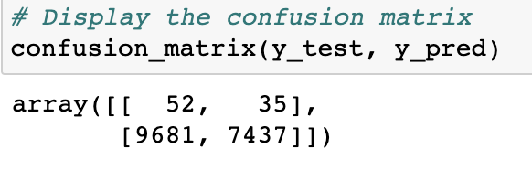

# Credit_Risk_Analysis

## Overview of Project
The purpose of this project is to predict credit risk and this was done by using machine learning. Different techniques were used to train and assess models, to identify which makes the most accurate prediction of credit risk. This was done using Python, Jupyter Notebook, Pandas and mlev environment. The various models/algorithms used in this analysis are as follows:

- Naive Random Oversampler (Oversampling)
- SMOTE algorithms (Oversampling)
- ClusterCentroids algorithm (Undersampling)
- SMOTEENN algorithm (Combine oversampling and undersampling)
- BalancedRandomForestClassifier (bias reduction model)
- EasyEnsembleClassifier (bias reduction model)

## Results
This sections include the the balanced accuracy score, confusion matrix and imbalanced classification reports for each algorithms.

### Naive Random Oversampler
 
   

   
   
   

- The balanced accuracy score is 0.6497536370265621.
- The "High Risk" precision rate was only 1% with the recall at 62% giving this model an F1 score of 2%.
- "Low Risk" had a precision rate of 100% and recall at 68%.

### SMOTE Oversampling

   

   
   
   
   
     
- The balanced accuracy score is 0.6443721269403855.
- The "High Risk" precision rate was only 1% with the slight increase in recall at 63% giving this model an F1 score of 2%.
- "Low Risk" had a precision rate of 100% and slight decrease in recall at 66%.

### ClusterCentroids algorithm (Undersampling)

   

   
   
   
   
   
- The balanced accuracy score is 0.51607805455842.
- The "High Risk" precision rate was only 1% with the recall at 60% giving this model an F1 score of 1%.
- "Low Risk" had a precision rate of 100% and a big drop in recall at 43%.

### SMOTEENN algorithm (Combined oversampling and undersampling)

   

   
   
   

- The balanced accuracy score is 0.6376117496807152.
- The "High Risk" precision rate was only 1% with the recall at 70% giving this model an F1 score of 2%.
- "Low Risk" had a precision rate of 100% and recall at 57%.

### BalancedRandomForestClassifier (bias reduction model)

   

   
   
   

- The balanced accuracy score is 0.7877672625306695.
- The "High Risk" precision rate was only 4% with the recall at 67% giving this model an F1 score of 7%.
- "Low Risk" had a precision rate of 100% and improved recall at 91%.

### EasyEnsembleClassifier (bias reduction model)

   

   
   
   

- The balanced accuracy score is 0.925427358175101.
- The "High Risk" precision rate was only 7% with the recall at 91% giving this model an F1 score of 14%.
- "Low Risk" had a precision rate of 100% and an higher recall at 94%.

## Summary
All the models used to perform the credit risk analysis show weak precision in determining if a credit risk is high.
The Clustercentroids has the lowest balanced accuracy score and the lowest sensitivity score of 60%. This makes undersampling model unfit for predicting credit risk. The other algorithms fall within the same range of 60's in sensitivity of the high risk credits except for SMOTEEN (combined oversampling and undersampling) and EasyEnsemble model.
The Ensemble models has the most improvement with the highest balanced accuracy score and sensitivity of the high risk credits.
The EasyEnsembleClassifier model shows a recall of 91% so it detects almost all high risk credit. Although, with a low precision, a lot of low risk credits are still falsely detected as high risk which can potentially affect the bank's credit strategy.
For these reasons, I would not recommend any of these models to predict credit risk.
